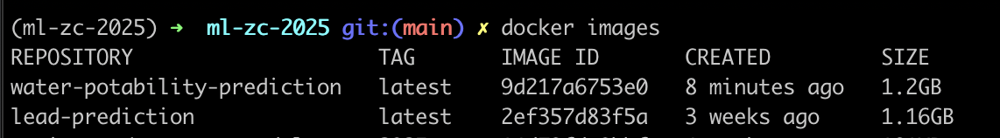
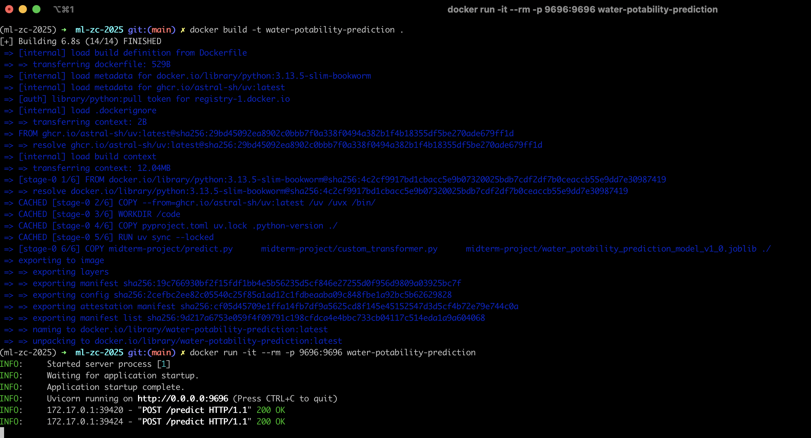

# MidTerm Project

## Problem Description

Safe drinking water is a necessity and right for all humans. However, many people around the world still lack access to
safe drinking water. In this project, we will analyze a dataset related to water quality and build machine learning
models to predict water potability. This will benefit organizations and governments in identifying unsafe water sources
and taking necessary actions to ensure access to safe drinking water.

Data used from Kaggle [here](https://www.kaggle.com/datasets/adityakadiwal/water-potability/data).

### Dataset Description

The dataset contains water quality metrics for 3276 different water bodies. Following are the features in the dataset:

1. ph
2. Hardness
3. Solids
4. Chloramines
5. Sulfate
6. Conductivity
7. Organic_carbon
8. Trihalomethanes
9. Turbidity
10. Potability (1 if safe for human consumption, 0 otherwise)

### Objective

Objective of the project is to build classification models to predict whether the water is potable
(safe for human consumption) or not based on the water quality metrics.

Five models will be built and compared:
1. Decision Tree Classifier
2. Random Forest Classifier
3. XGBoost Classifier
4. Tuned Random Forest Classifier
5. Tuned XGBoost Classifier

## Files

### midterm-project folder (ml_zc-2025/midterm-project)

Following are the files in the project folder.

1. `water_potability.csv`: Dataset containing water quality metrics and potability labels.
2. `notebook.ipynb`: Jupyter notebook containing data analysis, model building, and evaluation for the project,
   with each section well commented.
3. `train.py`: Python script to train the model independent of the notebook.
4. `predict.py`: Python script to run the webservice serving the model for making predictions on water potability.
5. `customer_transform.py`: Python script containing custom data transformation functions used in the project.
6. `test.py`: Python test script demonstrating the webservice prediction functionality.
   This is done by sending 2 sample requests to the webservice and printing the responses.
7. `water_potability_prediction_model_v1_0.joblib` : Trained model saved using joblib library.
   This is also loaded by the webservice for making predictions.
    - **Note** : Log from model training [here](logs/model-training.log)

### Parent Folder (ml_zc-2025)

1. `Dockerfile` : Dockerfile to create a docker image for the water potability prediction webservice.
2. `uv.lock` : Uvicorn configuration file for running the webservice containing the dependency graph versions.
3. `requirements.txt` : Text file containing the required python packages to run the webservice
4. `.python-version` : Text file specifying the python version used in the project.
5. `pyproject.toml` : Configuration file for the project specifying the build system requirements.

## Steps to run the service using Docker

1. Navigate to the parent folder (ml_zc-2025) containing the Dockerfile.
2. Build the docker image using the command:
    ```
    docker build -t water-potability-prediction
    ```
   **Note** : Ref docker build log [here](logs/docker-build.log)
3. Run the docker container using the command:
    ```
    docker run -it --rm -p 9696:9696 water-potability-prediction
    ```
   **Note** : Ref docker run log [here](logs/docker-run.log)
4. Run the test.py script to send sample requests to the webservice and print the responses.
   **Note** : Ref test.py output log [here](logs/docker-response.log)

## Steps to install dependencies and run the service locally

1. Follow the steps in ../uv-installation.md to install uv and dependencies.
2. `uv add -r requirements.txt` would install the required libraries.
3. Run the webservice using the command:

## Screenshots & recording

### Testing Video

<div style="text-align: left;">
  
</div>

### Docker Image

<div style="text-align: left;">
  
</div>

### Docker Build and Run Logs

<div style="text-align: left;">
  
</div>


