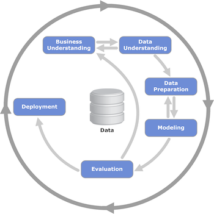

## Notes

### Video 1 : Intro to ML

----

- **Example** : Car price prediction
- ML Models can act as experts in predicting the selling price of a car, by extracting patterns from historical data
- Features and Predictions
  - Features are the input variables used to make predictions. E.g., year, make, mileage
  - Prediction is the selling price of the car

### Video 2 : ML v Rule based Systems

----

- **Example** : Spam detection
- Rules for detecting spam emails
  - Rules could be made based on specific email addresses, title, body, keywords etc.,
  - The rules will not be comprehensive, require continuous updates to the filters and will fail to catch new spam patterns
- Using ML for spam detection
  - get data : data from the emails classified as spam or not spam can be used 
  - define and calculate features : features can be arrived at based like length of title, description, presence of certain keywords, sender address etc.,
  - train and use a model : the features can be used to train a model to classify spam emails
- Data + Model = Outcome (spam or not)

### Video 3:  Supervised ML

----

- Supervised ML uses labels
  - In car Example price was provided as a label for machine to learn from (Regression)
  - Similarly in spam detection, spam or not spam was the label (Classification)
- Pictures can also be used as data and labels can be provided for supervised learning

#### Feature Matrix
- Features are extracted from the data and used to train the model
  - Feature Matrix is used to represent the features extracted from the data
  - Rows are data points and columns are features
  - Feature Matrix is usually denoted by 'X'
  - For each row we have target label (represented as y, one dimensional array)
- `g(X) ~= y`
  - 'g' is the model
  - 'X' is the feature matrix
  - 'y' is the target label
- 'y', the predicted value is an approximate or closest to the actual value
- Sample feature matrix for car price prediction

| Feature 1 | Feature 2 | Feature 3 | Feature 4 | Feature 5 | Target Variable |
|-----------|-----------|-----------|-----------|-----------|-----------------|
| 0         | 1         | 1         | 0         | 1         | 0               |
| 0         | 1         | 1         | 0         | 1         | 0               |
| 1         | 0         | 0         | 1         | 1         | 1               |
| 0         | 0         | 1         | 1         | 0         | 0               |
| 1         | 1         | 0         | 1         | 0         | 1               |

#### Types
1. Regression
2. Classification
   - Multiclass classification
   - Binary classification
3. Ranking E.g., used in recommender systems

### Video 4 : CRISP - DM ML process

----

- CRISP - DM : Cross Industry Standard Process for Data Mining
- CRISP has 6 steps

1. Business Problem understanding
   - Identify and understand the Problem
   - Key Question asked here is "Do we need ML here and will ML help here ?"
   - Arrive at a way of measuring success e.g., Reduce spam by 20%
2. Data Understanding
   - Availability of data
   - Identify the data sources or collect data
   - Questions like "Is the data good enough, reliable?", "Is the data set large enough or do we need more data?"
   - If there are limitations w.r.to data, we go back to step 1 and reevaluate the measure or the problem
3. Data Preparation
   - Clean the data
   - Setup data pipeline
   - Convert to tabular format
   - E.g, email info put into a tabular form with columns like sender, receiver, subject, spam or not etc., and features extracted
4. Modeling
   - We decide on the model to be used
   - There are many models to choose from
     1. Logistic Regression
     2. Decision Trees
     3. Neural Networks
     4. Others
   - We add more features if needed or fix data issues here after choosing the model and go back to step 3
5. Evaluation
   - Here we evaluate the model and ask questions like 
     - "have we reached our goal ?
     - "do our metrics improve ?""
     - E.g., "have we reduced spam by 20% ?"
   - based on the evaluation we may 
     - go back to step 1 and adjust the goal (or) 
     - even stop the project (or)  
     - rollout to more users
6. Deployment
   - Evaluation and deployment generally come together
   - Evaluation done on 5-10% users and if results are good, rollout to all users
   - Here the focus is on quality, maintainability
     - Engineering practices are applied at this stage

- **Note** : The entire flow is iterated 

### Video 5 : Model Selection Process

----

- Goal is to select the best model for the problem
- July and August examples of emails is explained

#### Train and Validation 
- Data is split into 2 parts
  1. 80% for Training
  2. 20% for Validation
- 'X', 'y' are created from the training data and the model is trained
- 'Xv', 'yv' are created from the validation data and the model is validated
- `g(Xv) ~= yv` is done to validate the model
- Predictions are compared with the target variable to evaluate the model and the accuracy is calculated
- These evaluations are done for different models 
  - E.g, in the email spam case, decision tree, logistic regression, neural networks etc., can be tried
  - The accuracy of decision tree could be 60%, logistic regression 70% and neural networks 80% and neural networks could be selected as the best model

#### Train, Validation and Test
- Models may get lucky and predict well on the validation set, when repeated multiple times
- To handle this the dataset is split into 3 parts
  1. 60% for Training
  2. 20% for Validation
  3. 20% for Testing
- After training and validating the model, the model is tested on the test set
  - The test data is never seen by the model before
  - This will reflect the model performance in the real world, in a better way

#### Steps
1. Split the data into train, validation and test sets
2. Train multiple models on the training set
3. Validate multiple models on the validation set
4. Select the best model
5. Test the best model on the test set
6. Check the accuracy on the test set

### Video 6 : Environment setup

----
- Environment is setup using `uv` on local Mac
- Refer [here](../uv-installation.md)

### Video 7 : Numpy

----

- [Numpy Practice Jupyter Notebook](./w1-07-numpy-practice.ipynb)

### Video 8 : Linear Algebra Refresher

----
 

- [Linear Algebra Practice Jupyter Notebook](./w1-08-linear-algebra.ipynb)

- Vector Operations
  - Scalar Multiplication
  - Vector Addition 
- Vector-Vector multiplication or Dot Product
- Matrix vector multiplication
- Matrix Matrix multiplication
- Identity Matrix

### Video 9 : Pandas

----

- For working with tabular data
- 
- [Pandas Practice Jupyter Notebook](./w1-09-pandas.ipynb)